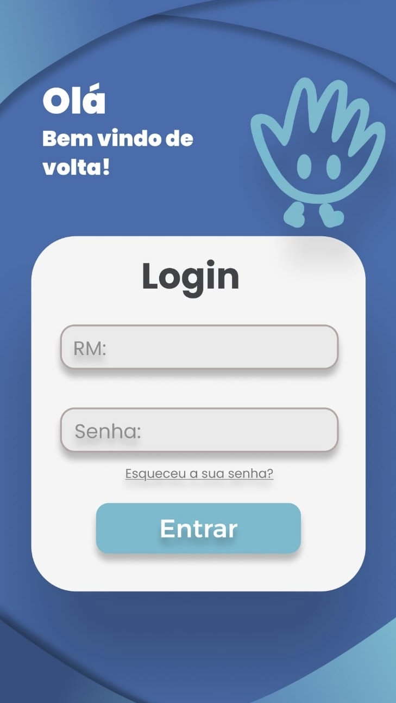
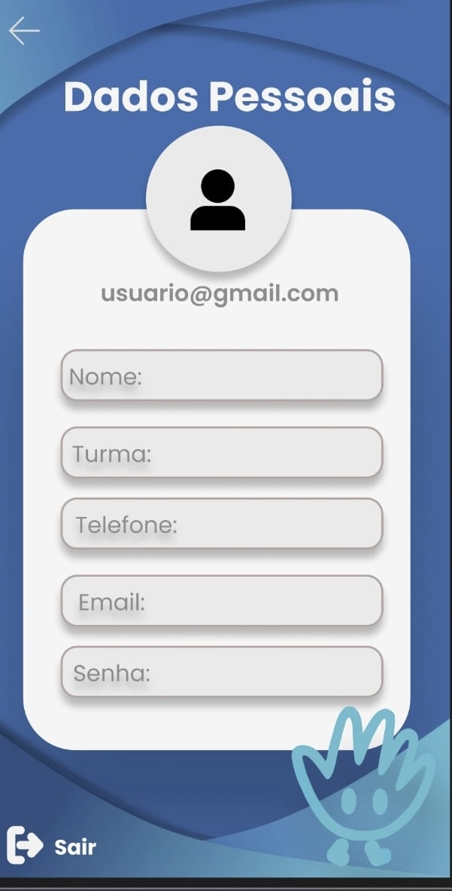
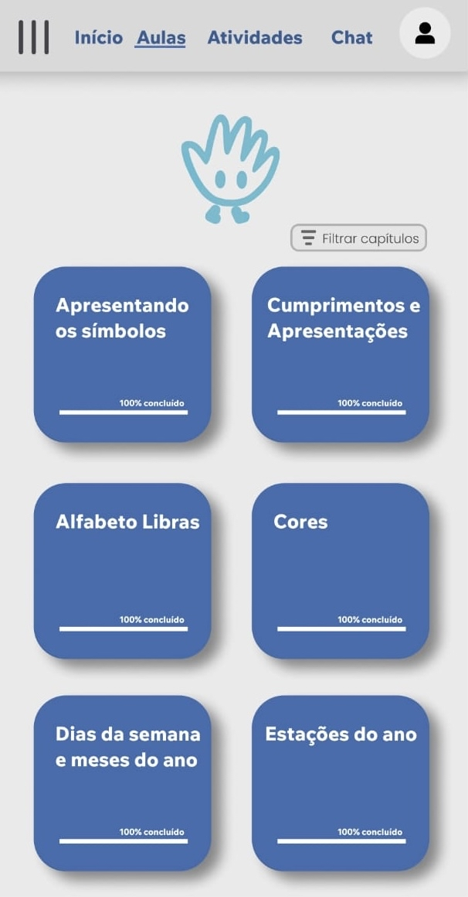
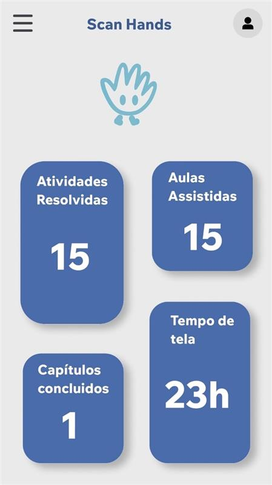
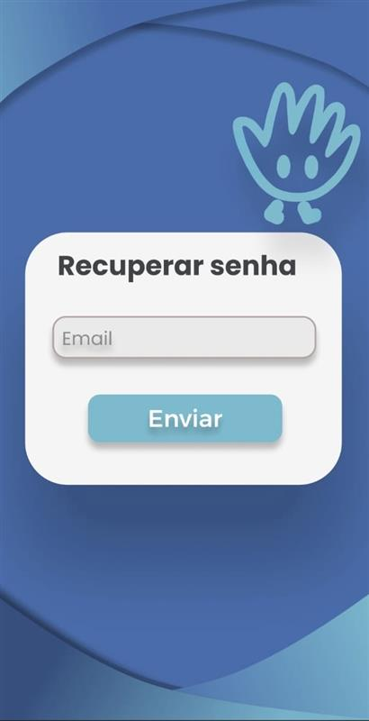

# ProjetoPAM🚀 
# SCAN HANDS 
<h2>Aplicativo para visualização de login e novas atividades do aluno</h2>
## Integrantes do Projeto🤝 
*Isabela Leme Cruz 
*Laura Gonçalves Flausino 
*Maria Fernanda Openheimer 
*Miguel Maia 
*Nathali Pasquim Ribeiro 
*Patrick Heloi 

### Telas  
Abaixo, telas do prototipo:  
 

Tela Login, que permite o usuario já cadastradro acessar sua conta 

Tela Cadastro que permite ao usuario realizar sua inscrição 

Tela Aulas que permite o usuario ver suas aulas 

Tela Atividade que permite o usuario a veificar suas atividades realizadas 

Tela de recuperação de senha, permite o usuario recuperar sua senha

### REQUISITOS FUNCIONAIS E NÃO FUNCIONAIS  
### REQUISITOS FUNCIONAIS:</h2> 
  *Botão de concluir que verifica a conta do usuario; 
  *Botão de esqueci a senha; 
  *TextBox; 
  *Botão de conlusão; 
  *Cards de Visualizão; 
  *Botão Menu; 
  *Botão Sair; 
   
  ### REQUISITOS NÃO FUNCIONAIS:</h2> 
  *React Native; 
  *Xampp; 
  *Visual Studio; 
  *Simulando no Windos10; 
  
  ### Tela de Cadastro </h2> 
  
