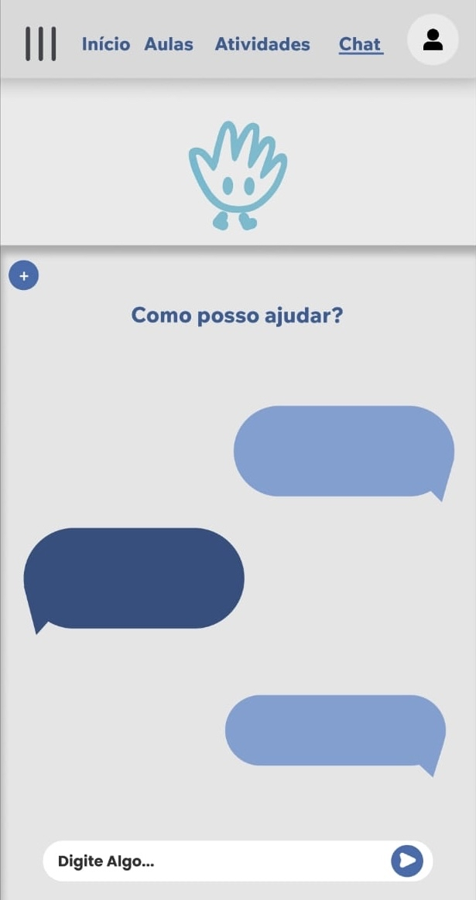

# ProjetoPAM🚀 
# SCAN HANDS 
<h2>Aplicativo para visualização de login e novas atividades do aluno</h2> 

## Integrantes do Projeto🤝 

*Isabela Leme Cruz 
*Laura Gonçalves Flausino 
*Maria Fernanda Openheimer 
*Miguel Maia 
*Nathali Pasquim Ribeiro 
*Patrick Heloi 

### Telas 
Abaixo, telas do prototipo  
 

Tela de login, que permite o usuario já cadastradro acessar sua conta 

Tela de cadastro que permite ao usuario realizar sua inscrição 

Tela Aulas que permite o usuario ver suas aulas 

Tela Chat que permite o usuario a acessar o chat 

Tela Atividade que permite o usuario a veificar suas atividades realizadas 

Tela de recuperação de senha, permite o usuario recuperar sua senha

